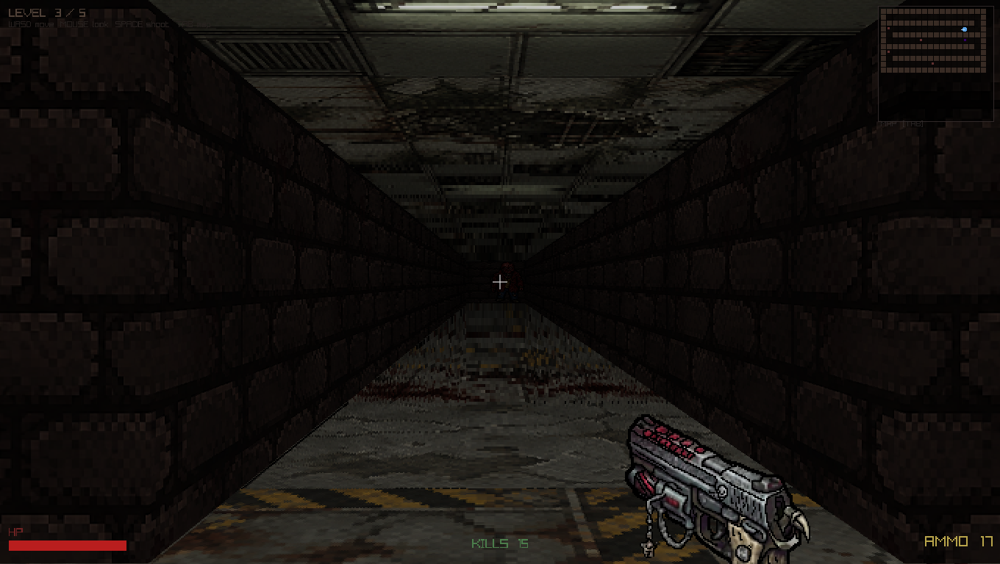
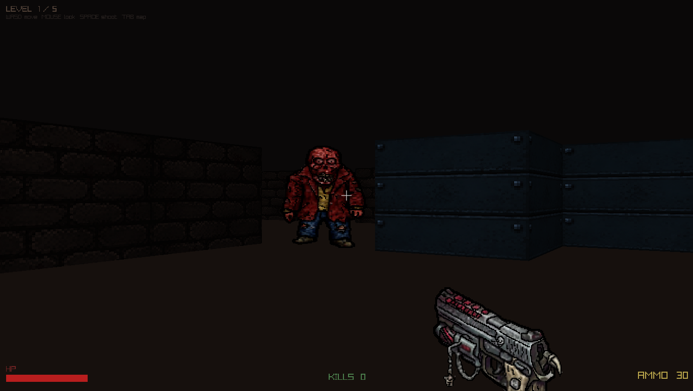

# 🩸 Blood Sector

A retro-inspired first-person horror shooter built in **C++** using **Raylib** and classic **raycasting techniques**.

Inspired by early FPS games like Doom, Blood Sector renders a pseudo-3D world entirely through custom raycasting without using a game engine.


---

## 📸 Screenshots

<p align="center">
  
</p>

<p align="center">
  
</p>

---

## 🎮 Features

* Classic Doom-style raycast rendering
* Multiple enemy types with unique AI behaviors
* Progressive multi-level campaign
* Boss battle finale
* Dynamic sprite rendering
* Minimap system
* Ammo pickups and resource management
* Sound effects and background music
* Cross-platform CMake build system

---

## 👾 Enemy Types

| Enemy   | Health | Behavior                           |
| ------- | ------ | ---------------------------------- |
| Walker  | 3 HP   | Random patrol, chase, melee attack |
| Stalker | 5 HP   | Moves only when not being observed |
| Boss    | 20 HP  | Charge attacks and summons Walkers |

---

## 🗺️ Levels

| Sector        | Description                        |
| ------------- | ---------------------------------- |
| The Breach    | Introduction to core mechanics     |
| The Corridor  | Tight spaces and ambush encounters |
| The Labyrinth | Maze-like navigation challenge     |
| The Core      | Final boss arena                   |

---

## 🎯 Controls

| Key                | Action         |
| ------------------ | -------------- |
| W A S D            | Move           |
| Mouse              | Look Around    |
| Left Click / Space | Shoot          |
| TAB                | Toggle Minimap |
| R                  | Restart Level  |
| ESC                | Exit Game      |

---

## 🔧 Building

### Requirements

* C++17 compatible compiler
* CMake 3.15+

### Clone Repository

```bash
git clone https://github.com/yourusername/blood-sector.git
cd blood-sector
```

### Configure

Windows (MinGW)

```bash
cmake -B build -G "MinGW Makefiles"
```

Linux / macOS

```bash
cmake -B build
```

### Build

```bash
cmake --build build
```

### Run

Windows

```bash
./build/Blood-Sector.exe
```

Linux / macOS

```bash
./build/Blood-Sector
```

> Note: Copy the `assets/` folder into the build directory before running the executable.

---

## 📂 Project Structure

```text
blood-sector/
│
├── src/
│   ├── main.cpp
│   ├── Game.h / Game.cpp
│   ├── Renderer.h / Renderer.cpp
│   ├── Player.h / Player.cpp
│   ├── Enemy.h / Enemy.cpp
│   ├── Entity.h / Entity.cpp
│   ├── Map.h / Map.cpp
│   └── LevelManager.h / LevelManager.cpp
│
├── assets/
│   ├── sprites/
│   ├── sounds/
│   └── music/
│
├── screenshots/
├── CMakeLists.txt
├── README.md
└── BUILD.md
```

---

## 🧠 Technical Highlights

* Object-Oriented Design
* Inheritance & Polymorphism
* Dynamic Enemy Management
* DDA Raycasting Algorithm
* Sprite Projection Rendering
* Collision Detection System
* State-Based Game Architecture

---

## 🛠 Technologies Used

* C++
* Raylib
* CMake
* Object-Oriented Programming

---

## 📜 License

This project is licensed under the MIT License.

